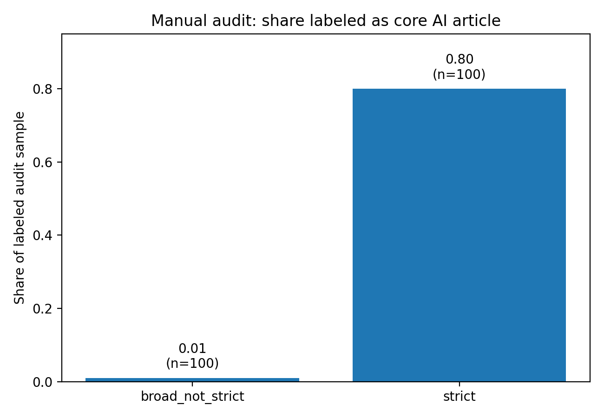
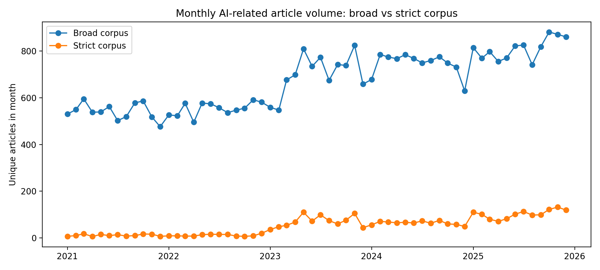
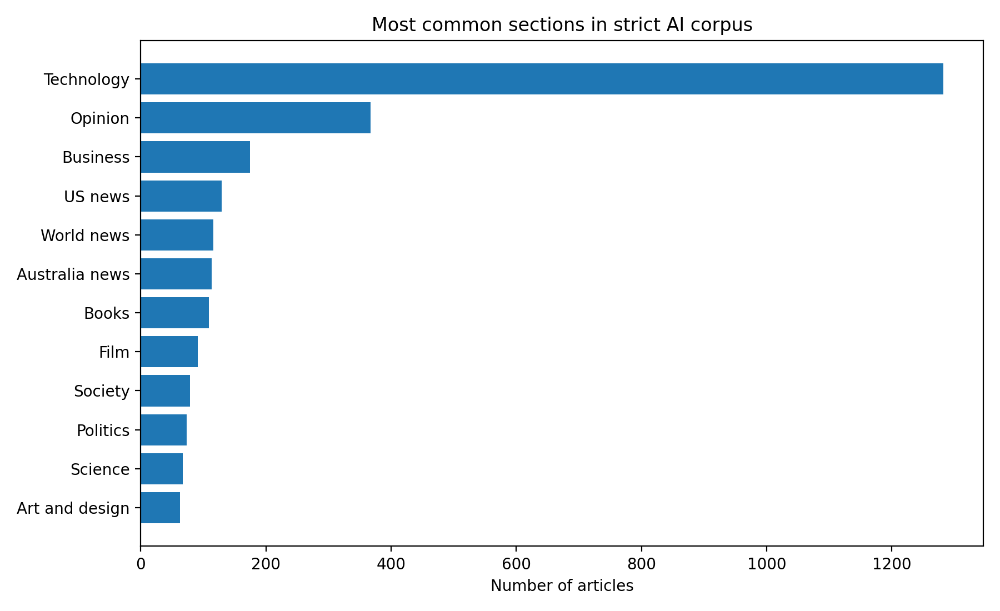
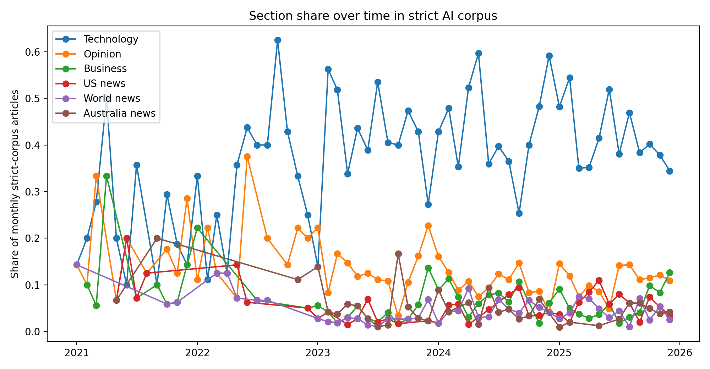
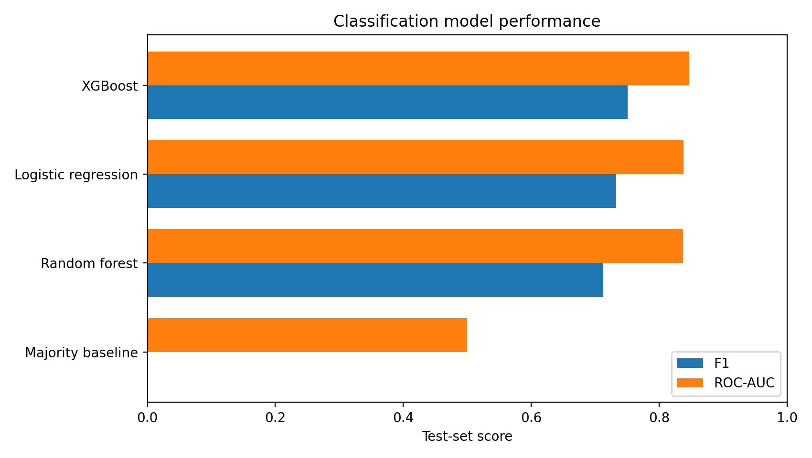
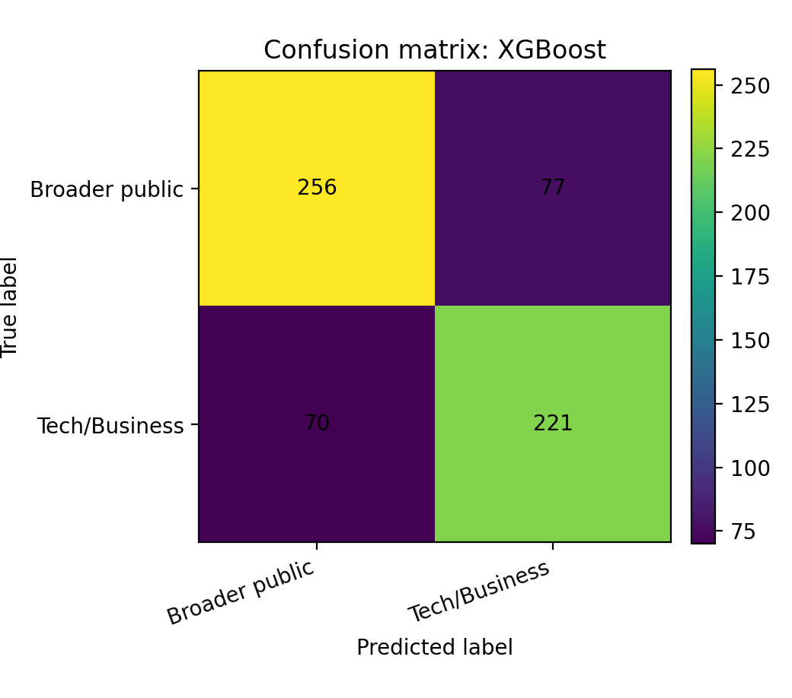
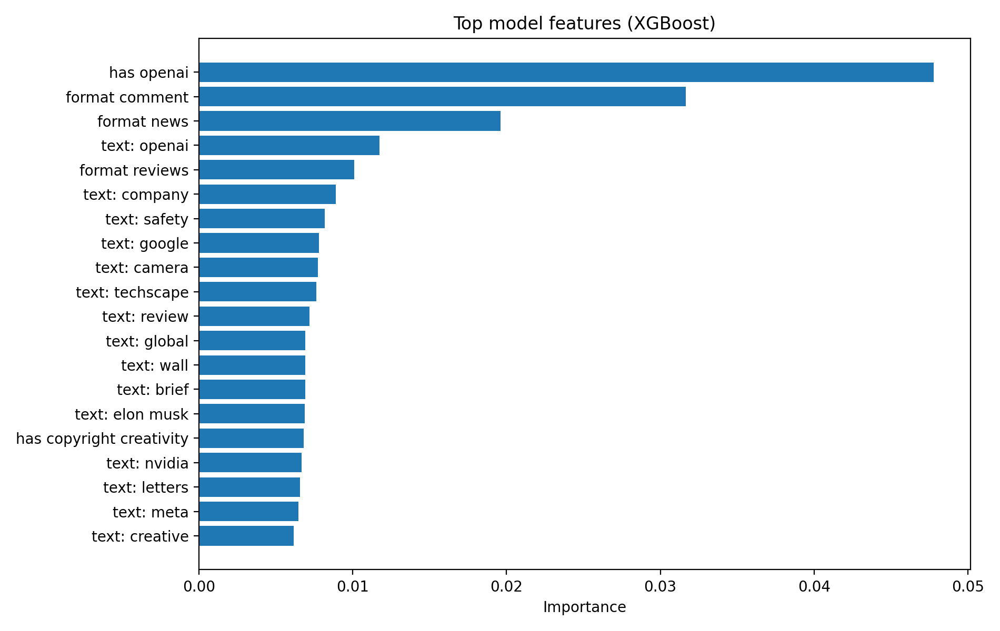
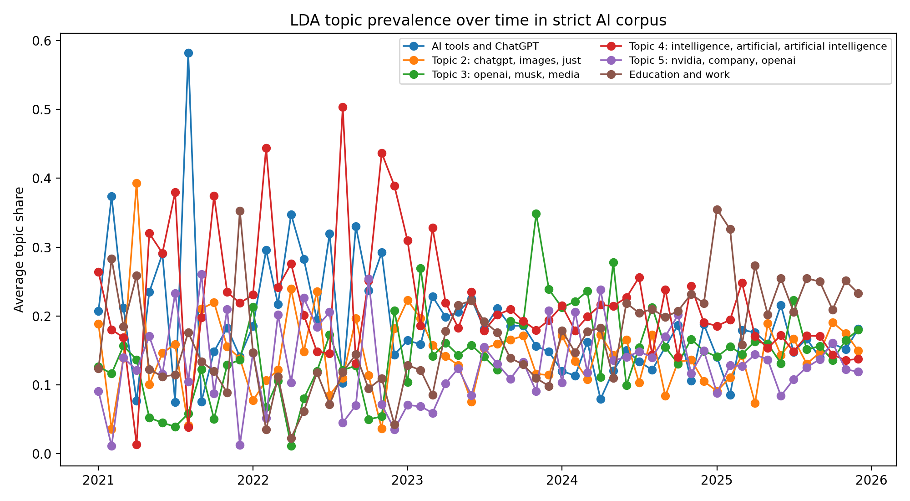

# Introduction

Artificial intelligence is not only a technical topic. Since the rise of public-facing generative AI tools, AI has become linked to labor markets, education, copyright, misinformation, elections, regulation, business competition, creative industries, and everyday culture. News coverage matters because it shapes how the public encounters these risks and opportunities. *The Guardian* is a useful case for studying this shift because its AI-related articles appear across technology, business, politics, world news, opinion, culture, and lifestyle sections rather than only in technology reporting.

This final project builds on the midterm project by moving from descriptive corpus analysis to validation and modeling. The main research question is:

> How did *The Guardian's* AI-related coverage change between 2021 and 2025, and can article text and metadata predict whether an AI-related article is framed as a technology/business issue or as a broader public issue?

I test four hypotheses. First, AI-related coverage increased over time. Second, AI coverage appears across many sections rather than being limited to the Technology section. Third, article text and metadata can predict whether an article belongs to a Technology/Business frame or a broader public-issue frame. Fourth, topic modeling will reveal several recurring themes, including AI tools, business competition, regulation, education, copyright, labor, and risk.

# Methods

## Data source and corpus construction

The data come from the Guardian Content API. I query articles month by month from January 2021 through December 2025. The final search strategy expands the original midterm search terms by combining general AI terms, technical terms, and public-facing generative AI terms. The query terms include artificial intelligence, machine learning, generative AI, large language model, ChatGPT, deep learning, neural network, LLM, OpenAI, Google Gemini, Google DeepMind, Claude AI, DALL-E, and Midjourney. I intentionally avoid using standalone "AI" as a broad API query because it can be overinclusive, but I allow standalone AI in stricter headline, trail-text, and tag matching when it appears with relevant context.

Articles are deduplicated by Guardian article ID. The broad corpus contains all articles retrieved by the union of search terms. The strict corpus keeps only articles with strong AI signals in Guardian keyword tags or in headline and trail text. This broad-versus-strict design separates a high-recall search environment from a higher-precision approximation of core AI coverage.

## Manual audit

Because the strict corpus is rule-based rather than a fully hand-labeled gold-standard dataset, I manually audit a sample of articles. The audit compares 100 strict-corpus articles with 100 broad-but-not-strict articles. Each article is labeled as `core_ai_article`, `incidental_ai_mention`, or `unclear`. This check evaluates whether the strict corpus improves precision relative to the broad search corpus.

## Prediction task and feature engineering

The main prediction task classifies whether a strict-corpus AI article is framed as a Technology/Business story or as a broader public-issue story. The target variable is:

- `tech_business_frame = 1` for articles in the Technology or Business section.
- `tech_business_frame = 0` for articles in all other sections.

The model uses headline and trail-text TF-IDF features, time variables, word count, headline and trail-text length, keyword indicators, editorial-format indicators, tag counts, and VADER sentiment. Section name is excluded from the predictors to avoid data leakage because the target variable is derived from section membership.

I compare a majority-class baseline, logistic regression with TF-IDF, Random Forest, and XGBoost when the package is available. The data are split into stratified training and testing sets, with 80% for training and 20% for testing. Model performance is evaluated using accuracy, precision, recall, F1, and ROC-AUC. Variable importance is reported using tree-based feature importance or, for logistic regression, absolute coefficient magnitude.

## Topic modeling and interactive visualization

To study themes in AI coverage, I also fit an LDA topic model using the strict corpus headline and trail text. The topic model is used to identify recurring themes and to track topic prevalence over time. Interactive Plotly visualizations are provided on the project website for monthly article volume, section composition over time, and LDA topic prevalence over time.

# Results





{width=70%}

Figure 1 shows that the strict corpus is substantially more precise than the broad-but-not-strict set. This supports using the strict corpus for the final modeling and topic analysis.

{width=95%}

Figure 2 shows the monthly volume of AI-related articles. The broad corpus captures the wider search environment, while the strict corpus captures a narrower set of articles with stronger AI relevance.

{width=90%}

Figure 3 shows that strict-corpus AI articles are distributed across multiple sections. This supports the interpretation that AI is not only a technology story but also a broader public issue.

{width=95%}

Figure 4 shows that section composition changes over time. This is consistent with the idea that the public meaning of AI shifts across technology, business, politics, opinion, world news, and cultural contexts.

{width=85%}

Figure 5 compares the baseline and machine-learning models on the test set. A model that improves on the majority baseline indicates that article text and metadata contain information about whether an AI article is framed as a Technology/Business story or a broader public-issue story.

{width=70%}

Figure 6 shows the selected model's classification errors. The confusion matrix is useful because the two classes are substantively different: Technology/Business framing reflects narrower industry and technical coverage, while broader public-issue framing reflects social, political, cultural, and institutional coverage.

{width=90%}

Figure 7 reports the most influential features. These features help interpret which terms and metadata patterns distinguish Technology/Business AI coverage from broader public-issue AI coverage.

{width=95%}

Figure 8 shows how topic prevalence changes over time. The LDA model supports the conclusion that AI coverage is not a single homogeneous category. Instead, it contains multiple recurring themes, including tools, business competition, regulation, education, labor, copyright, and risk-related coverage. The interactive version of this figure is available on the website.

# Conclusions and Summary

This project shows that *The Guardian's* AI-related coverage increased and diversified between 2021 and 2025. The broad corpus is useful for describing the overall AI-related search environment, but the manual audit shows that the strict corpus is a better dataset for modeling core AI coverage. The strict corpus contains articles across many sections, which supports the central claim that AI has moved beyond a narrow technology frame and has become a broader public issue.

The classification analysis shows whether article text and metadata can predict Technology/Business framing versus broader public-issue framing. The model comparison, confusion matrix, and feature-importance plot make the prediction task interpretable rather than only descriptive. The LDA topic model further shows that AI coverage contains several themes rather than a single unified topic.

There are several limitations. First, the project studies one news organization, so the results should not be treated as representative of all media coverage. Second, the strict corpus is rule-based and validated only with a small manual audit sample. Third, the analysis relies mostly on headline and trail text rather than full article bodies. Fourth, sentiment and topic models are useful summaries but do not establish causal effects. Future work could compare multiple newspapers, label a larger validation set, use full article text, and study how specific events changed the framing of AI coverage over time.
